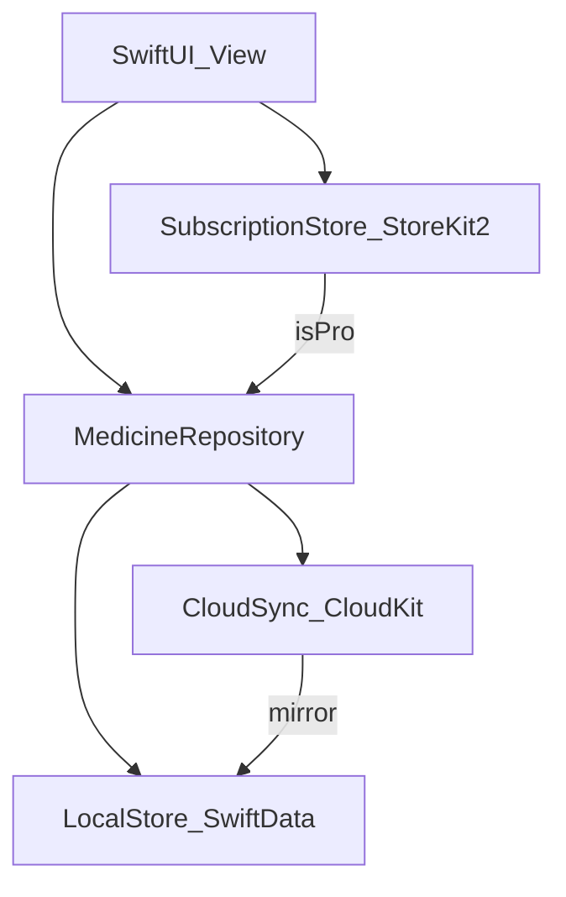

# Premium: lokalne SwiftData + CKShare + StoreKit

## Kontekst

Aplikacja dziś trzyma leki w SwiftData ([`Medicine.swift`](aegis/Models/Medicine.swift)), a CloudKit private sync jest tylko przełącznikiem w [`aegisApp.swift`](aegis/aegisApp.swift) (`StorageOptions.isCloudKitEnabled = false`). Widoki używają `@Query` / `modelContext` bezpośrednio — nie ma repozytorium ani StoreKit.

**SwiftData + `cloudKitDatabase: .automatic` nie wspiera CKShare.** Dlatego Pro nie włączy wbudowanego syncu SwiftData. Zamiast tego:

- **LocalStore** = SwiftData na urządzeniu (szybkie ładowanie, obecne UI prawie bez zmian)
- **CloudSync** = własny sync CloudKit (strefa prywatna + `CKShare` + shared DB), który mirroruje rekordy do/z LocalStore

| Tryb | Magazyn | Sync | Sharing | Archiwum |
|------|---------|------|---------|----------|
| Free | SwiftData lokalnie | brak | brak | brak — tylko trwałe usunięcie |
| Pro | SwiftData lokalnie | CloudKit private zone | CKShare apteczki z rodziną | archive / restore / tab Archiwum |

„iPhone only” w Free = brak syncu między urządzeniami (uniwersalny target zostaje; Pro odblokowuje iPhone/iPad/Mac + rodzinę).

---

## Archiwum = Pro

Dziś soft-delete (`archive` / `restore`) i tab Archiwum są dostępne dla wszystkich ([`MedicineActions`](aegis/Support/MedicineActions.swift), [`ArchiveView`](aegis/Features/Archive/ArchiveView.swift), swipe w liście, detail, Expired sheet). Po zmianie:

| Akcja | Free | Pro |
|-------|------|-----|
| Usuń lek z apteczki | **trwałe** `delete` (z potwierdzeniem) | `archive` + wybór powodu |
| Przywróć | niedostępne | `restore` |
| Tab Archiwum | ukryty | widoczny |
| Expired sheet / Dashboard „Do archiwum” | „Usuń” (trwale) | „Do archiwum” |

**Gate w kodzie:** `SubscriptionStore.isPro` przed `archive` / `restore`. Próba archiwizacji bez Pro → `PaywallView`. Repozytorium też odrzuca `archive`/`restore` gdy `!isPro` (ochrona poza UI).

**Call sites do przepięcia:**
- [`MedicineListView`](aegis/Features/Medicines/MedicineListView.swift) — swipe: Free=`delete` + confirm, Pro=`archive`
- [`MedicineDetailView`](aegis/Features/Medicines/MedicineDetailView.swift) — toolbar archive/restore
- [`DashboardView`](aegis/Features/Dashboard/DashboardView.swift) / [`ExpiredAlertSheet`](aegis/Features/Expired/ExpiredAlertSheet.swift) — bulk/one: Free delete vs Pro archive
- [`RootView`](aegis/Features/Root/RootView.swift) — tab Archiwum tylko gdy `isPro`
- [`ArchiveView`](aegis/Features/Archive/ArchiveView.swift) — tylko Pro (restore + permanent delete z archiwum)

**Downgrade Pro → Free:** lokalne zarchiwizowane rekordy zostają w SwiftData, ale tab Archiwum znika. Po odnowieniu Pro znów widać archiwum. Free nie oferuje restore ani podglądu archiwum.

**Upgrade Free → Pro:** pojawia się tab Archiwum (puste, jeśli wcześniej tylko kasowano).

---

## Jak działa App Store (krótko)

1. W **App Store Connect** tworzysz produkt subskrypcji (np. `com.amidev.aegis.pro.monthly` / `.yearly`).
2. Włączasz **Family Sharing** na produkcie IAP — członkowie rodziny Apple dostają entitlement Pro automatycznie (to nie jest jeszcze współdzielenie leków).
3. Aplikacja przez **StoreKit 2** sprawdza `Transaction.currentEntitlements` → `isPro`.
4. Gdy `isPro`: włączasz CloudSync i UI udostępniania apteczki (`CloudSharingView` / `UICloudSharingController`).
5. **CKShare** to osobna warstwa: właściciel udostępnia rekord/strefę „apteczka”; zaproszeni (różne Apple ID) widzą te same leki lokalnie po zsynchronizowaniu shared zone.

Do lokalnych testów: plik `.storekit` w Xcode (bez prawdziwych płatności). Na urządzeniu: Sandbox Apple ID.

Domyślne produkty: **miesięczna + roczna** auto-renewable subscription, z Family Sharing włączonym w ASC.

---

## Warstwa danych

### `MedicineRepository`
Jedyny punkt mutacji z UI (zastępuje bezpośrednie `modelContext` w [`MedicineActions`](aegis/Support/MedicineActions.swift) i zapisach w formularzach):

- `fetch` / `upsert` / `delete` — dostępne zawsze
- `archive` / `restore` — tylko gdy `isPro`; inaczej no-op / błąd entitlement (UI wcześniej pokazuje paywall)
- zawsze zapisuje do **LocalStore**
- jeśli Pro: kolejkuje zmianę do **CloudSync**

Widoki mogą na start dalej czytać przez `@Query` (LocalStore), a zapisy iść przez repo — minimalny churn UI.

Dla Free `delete` usuwa rekord z LocalStore od razu (dziś `deletePermanently` jest tylko z archiwum — trzeba dodać ścieżkę delete z aktywnej listy + confirmation alert).

### `LocalStore`
Opakowanie obecnego `ModelContainer` / `ModelContext` (schema bez zmian; model już jest CloudKit-friendly: domyślne wartości, brak unique constraints).

### `CloudSync` (tylko Pro)
- Kontener: `iCloud.com.amidev.aegis` (już w [`aegis.CloudKit.entitlements`](aegis/aegis.CloudKit.entitlements))
- Root record: `Cabinet` (jedna apteczka właściciela) + rekordy `Medicine` w prywatnej custom zone
- Sync: `CKSyncEngine` (iOS 17+) albo fetch/push + subskrypcje — mirror UUID ↔ `CKRecord.ID` (pole `uuid` już jest w modelu)
- Sharing: `CKShare` na `Cabinet` → `CloudSharingView`; akceptacja share przez `onContinueUserActivity` / `CKShare.Metadata`
- Uczestnicy: shared DB → LocalStore (te same `@Query`)
- Konflikt: last-write-wins po `modifiedAt` (dodać pole do `Medicine` + CKRecord)

Entitlementy: skopiować iCloud z `aegis.CloudKit.entitlements` do aktywnego [`aegis.entitlements`](aegis/aegis.entitlements); usunąć/przestać polegać na `StorageOptions.isCloudKitEnabled` jako jedynym gate — gate = entitlement StoreKit.

### Free → Pro (upgrade)
1. Użytkownik kupuje Pro.
2. Tworzony jest `Cabinet` + upload lokalnych `Medicine` do private zone.
3. Opcjonalnie: „Udostępnij rodzinie” → sheet CKShare.
4. Na innych urządzeniach / u uczestników: download → LocalStore.

### Pro → Free (wygaśnięcie)
CloudSync się wyłącza; lokalna kopia zostaje (read/write lokalnie). Brak dalszego syncu/share updates do czasu odnowienia.

---

## StoreKit 2

Nowe typy (np. `Services/Subscription/`):

- `SubscriptionProductID` — stałe ID produktów
- `SubscriptionStore` (`@Observable`) — `Product.products`, `purchase`, `restore`, nasłuch `Transaction.updates`, `isPro`
- `PaywallView` — wybór planu + CTA
- `Configuration.storekit` — produkty testowe w Xcode

Wejście do paywalla: Settings / banner Pro przy próbie udostępnienia, syncu **lub archiwizacji**. `AppState` dostaje `isPro` z `SubscriptionStore`.

App Store Connect (manualnie, poza kodem): Agreements, subskrypcja, pricing, Family Sharing na IAP, Sandbox testerzy.

---

## UI (minimalnie)

- Ekran / sekcja **Ustawienia / Pro**: status entitlement, zarządzanie subskrypcją, „Udostępnij apteczkę”, lista uczestników share
- Sheet `CloudSharingView` gdy Pro i jest `CKShare`
- Komunikaty offline / brak iCloud account
- **Free vs Pro w apteczce:** Free — destructive „Usuń” + confirm; Pro — „Przenieś do archiwum” + powody; tab Archiwum tylko Pro
- Paywall przy próbie archive/restore bez Pro (np. gdy ktoś wejdzie głębiej przez deep link / stary stan UI)

---

## Testy

- Unit: `SubscriptionStore` z mockiem entitlement; mirror LocalStore ↔ rekordy CloudKit (bez sieci: encode/decode `Medicine` ↔ `CKRecord`)
- Unit: gate — `!isPro` → `archive`/`restore` zabronione; `delete` z aktywnej listy działa
- Istniejące [`MedicineTests`](aegisTests/MedicineTests.swift) zostają na LocalStore (archive/restore jako ścieżka Pro)
- Manual: StoreKit Configuration + dwóch Sandbox użytkowników (owner / participant) dla CKShare; przełączenie Free/Pro w Configuration i sprawdzenie tabu Archiwum

---

## Kolejność wdrożenia

1. `SubscriptionStore` + `.storekit` + Paywall (gate `isPro`)
2. **Gate archiwum w UI + MedicineActions/repo:** Free delete, Pro archive/restore, ukrycie tabu
3. `MedicineRepository` + `LocalStore`; przepięcie zapisów z `MedicineActions` / formularzy
4. Model `Cabinet` + pola sync (`modifiedAt`); entitlementy CloudKit
5. `CloudSync` private zone mirror (Pro, multi-device, to samo Apple ID)
6. CKShare + accept flow + UI udostępniania
7. Scenariusze upgrade/downgrade i testy rodzinne

Fazy 1–3 działają bez konta developerskiego CloudKit; 4–6 wymagają płatnego teamu + kontenera iCloud.